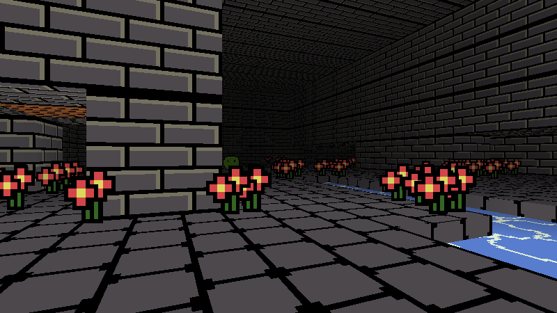

# andvaranaut

Andvaranaut aims to be a 2.5D dungeon crawler with procedural dungeon generation.
Your inventory is like a deck of cards; lootbags dropped by enemies are like booster packs.
Dive deep into the dungeon and tailor your combat preferences to melee, magic, archery, and gunpowder.

    make; ./andvaranaut

Controls:

    move: w,a,s,d

    turn: mouse

    open: e

    grab and attack: left mouse button

    exit: End

    edit: hold in left shift
