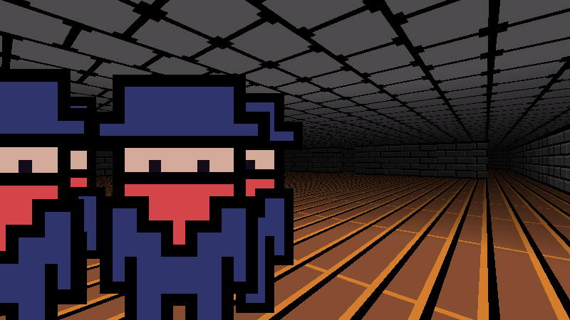

A 2.5D dungeon crawl game engine

Controls:

    move: w,a,s,d

    turn: mouse

    open: e

    grab: left mouse button

    exit: F1

Execution:

    ./water

    ./water xres yres fov fps

Screenshots:

As for the source:
- Files are sorted by related struct typedefs
- No global variables
- Externed functions prefixed with 'x'
- Compatible with c++ for easy forking
