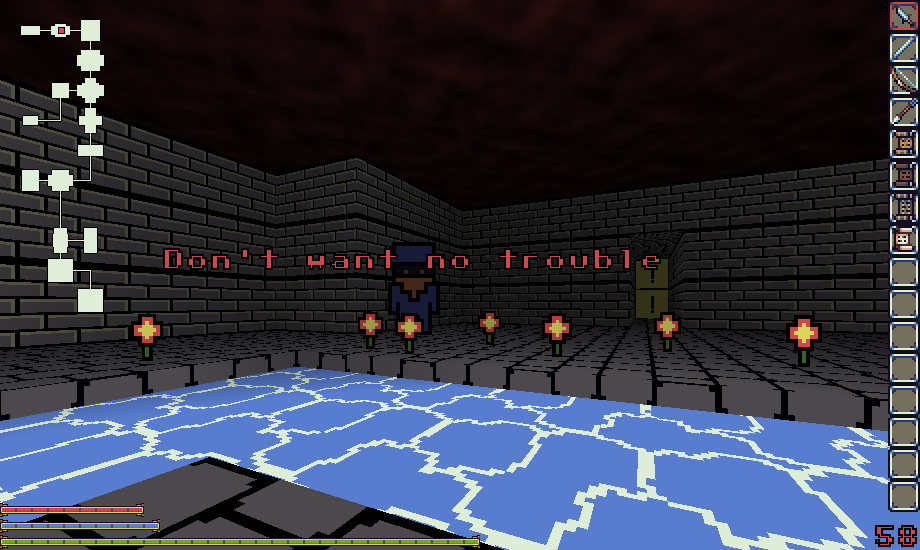

# Andvaranaut

The open source dungeon crawler

## Dependencies
    SDL2-ttf-devel
    SDL2-devel

## Building
    make -C src; ./andvaranaut

## Recommended System Requirements
    RAM: 256 MB
    CPU: 4 cores or more
    GPU: Just about anything will do

## Credits
Item art by Platino.

Color pallette by DawnBringer

## Special Thanks
Halic (Mac) - Prototype tile and sprite art work
