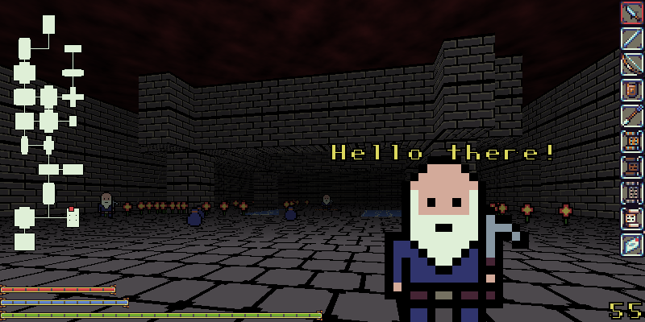

# Andvaranaut

The open source dungeon crawler

## Dependencies
    SDL2-ttf-devel
    SDL2-devel

## Building
    make -C src
    ./andvaranaut

## Recommended System Requirements
    RAM: 256 MB
    CPU: 2 cores or more
    GPU: Just about anything will do

## Quest
Your quest is to reach the bottom of Andvaranaut dungeon and retrieve Andvari's gift.
Along your way you will encounter beasts and dungeon dwellers searching for gold of similar fortune.
Some dungeon dwellers will be friendly. Help them and you will be rewarded, but keep in
mind each dweller has their own story to tell and problems to overcome. Choosing to end
the life of a dweller, or help the wrong dweller, may have unintended consequences.

## Controls
    E: Go up or down trapdoors
    Shift (Hold): Use inventory
    1, 2, 3, 4: Select inventory attack item
    W A S D and Mouse: Movement and combat

## Contributing
Sprite and tile art is always welcome but must be suitable for all ages. New questlines are welcome.

## Credits
Item art by Platino.

Color pallette by DawnBringer

## Special Thanks
Cam
    Artwork - Prototype tiles and sprites

Paolo
    Questline - Dwarven Brothers
