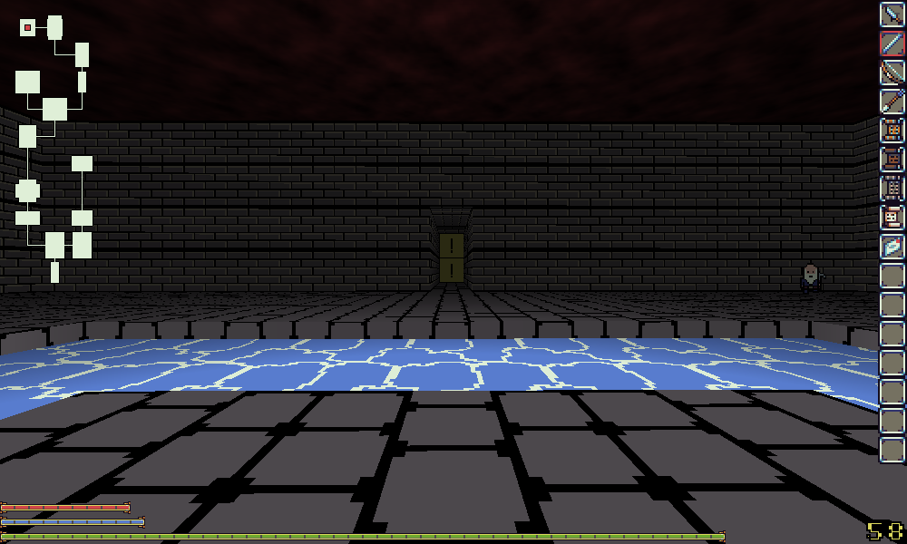

# Andvaranaut

The open source dungeon crawler

## Dependencies
    SDL2-ttf-devel
    SDL2-devel

## Building
    make -C src
    ./andvaranaut

## Recommended System Requirements
    RAM: 256 MB
    CPU: 2 cores or more
    GPU: Just about anything will do

## Quest
Your quest is to reach the bottom of Andvaranaut dungeon and retrieve Andvari's gift.
Along your way you will encounter beasts and dungeon dwellers searching for gold of similar fortune.
Some dungeon dwellers will be friendly. Help them and you will be rewarded, but keep in
mind each dweller has their own story to tell and problems to overcome. Choosing to end
the life of a dweller, or help the wrong dweller, may have unintended consequences.

## Controls
    E: Go up or down trapdoors
    Shift (Hold): Use inventory
    1, 2, 3, 4: Select inventory attack item
    W A S D and Mouse: Movement and combat

# Combat
Your enemy, be it dweller or beast, can be attacked in different ways.

## Melee

Enemies can be hurt from four melee directions.
To do so, select a melee weapon from your inventory, hold down the mouse,
and draw a directional shape from the center of the screen.
Enemies will attempt to block your attack. Be crafty by faking hits before striking.
Watch your green fatigue bar while striking - too long of a swing will tire you out.

## Range

Attacking with a range weapon creates an on screen reticule.
The smaller the reticule, the more accurate the shot. Ranged weapons, like the
dwarven revolver, suffer from poor target reticules but can be employed to tremendous
effect up close. Watch your green bar while drawing your bow or aiming your cannon -
your fatigue quickly deplenishes.

## Magic

Casting magic requires both a scroll and a wand be be present in your inventory.
While using the inventory, hover over the scroll to reveal its spell glpyh.
Equip the wand, and draw the shape of the spell glyph. The accuracy of the casted
glpyh will determine the potentcy of the spell (if available).
Watch your blue mana bar as you cast your spell - if you run out, the spell will reset,
and you will suffer a casting penalty.

## Contributing
Sprite and tile art is always welcome but must be suitable for all ages.

Gameplay ideas found in TODO are welcome as contributions. Source code is to be separated
by typedef, one per h file, and matched with a c file. Functions are verbs,
underscored lowercase, and led with a lower case alphabetical prefix to prevent namespace collisions.

## Credits
Item art by Platino.

Color pallette by DawnBringer

## Special Thanks
Cam - Prototype tile and sprite art work
