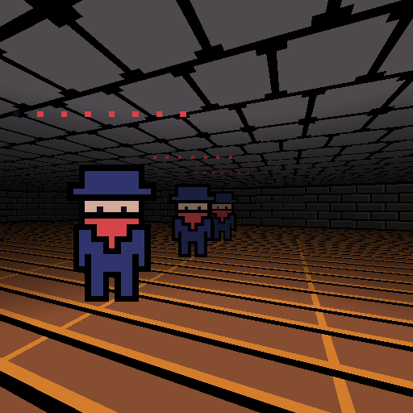

A 2.5D dungeon crawl game engine inspired by Dungeon Crawl Stone Soup

Controls:

    move: w,a,s,d

    turn: mouse

    open: e

    zoom: middle mouse button

    grab: left mouse button

    attack: left mouse button with mouse movement

    weapon select: [1] hands, [2] sword

    exit: F1

Execution:

    The first command line argument selects the resolution:
        ./water 768

    Resolution 512 is default

    Resolution 256 is reservered for performance testing and will exit
    after 60 rendered frames

Screenshots:

